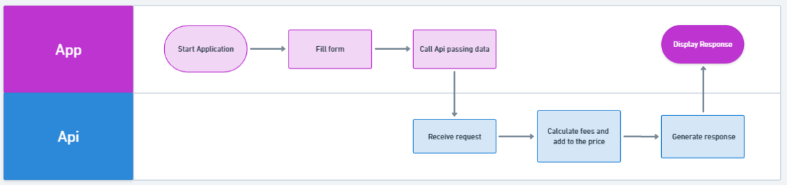
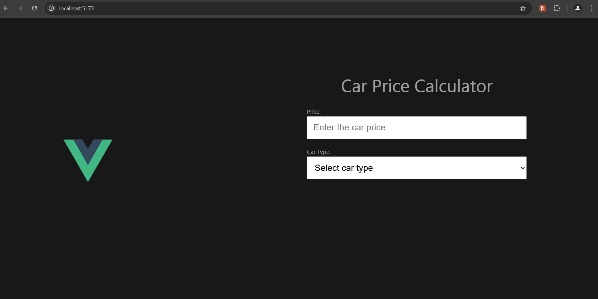
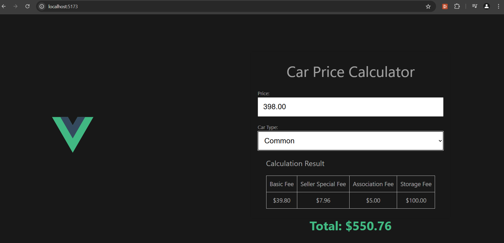
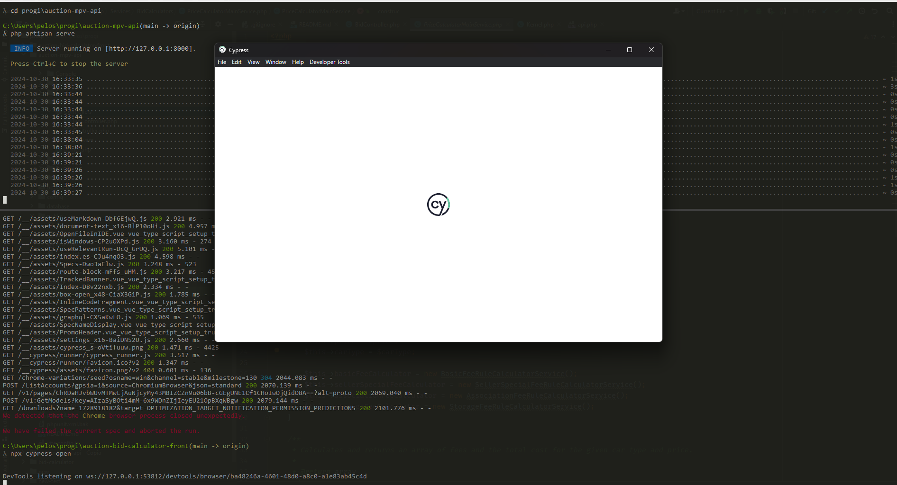
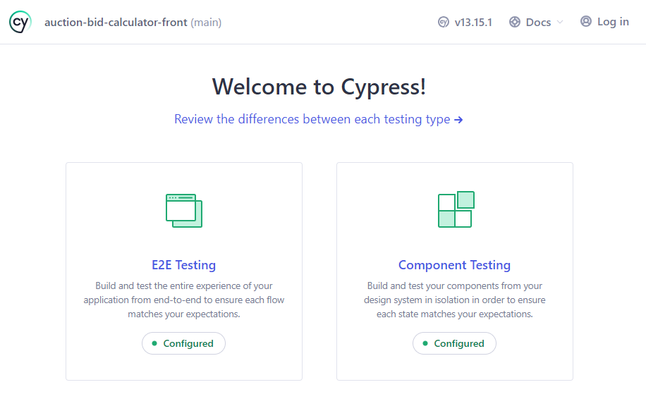
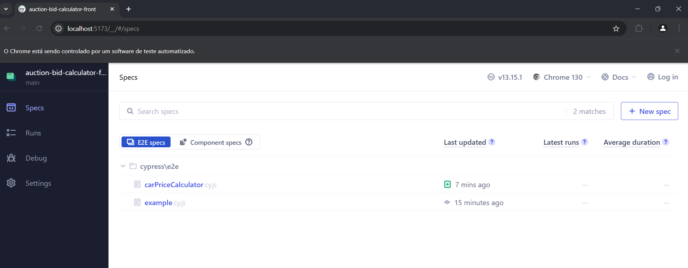
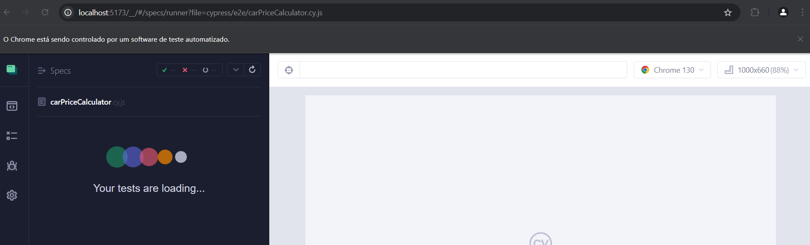
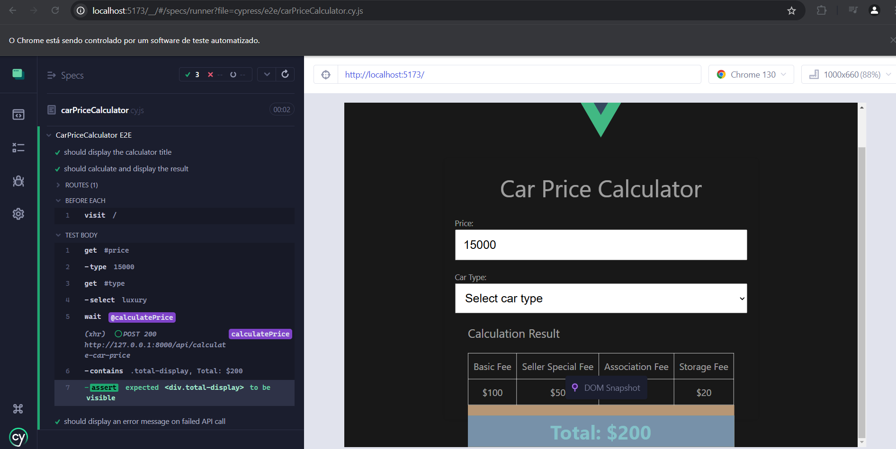

# Bid Calculator App

The Bid Calculator App was built using Vue 3 in Vite.

## Behaviour

The App receive data and pass them to the API for calculating fees by their rules and add them to the price. After calculation, the API response is displayed on the screen for the user.



## Setup

```sh
git clone git@github.com:marinapelosi/auction-bid-calculator-front.git
```

```sh
cd auction-bid-calculator-front
```

```sh
npm install
```

### Compile

```sh
npm run dev
```

### Usage

Access the server url [http://localhost:5173/](http://localhost:5173/)



Enter the car price and then select the car type complying with the following rules.

| Field | Rules  |
|---------- |----------|
| Car Price | Number min 1    |
| Car Type  | Common or Luxury |

Then wait for the calculation. It will be displayed below the form.



-------

### Run End-to-End Test with [Cypress](https://www.cypress.io/)

```sh
npx cypress open
```




